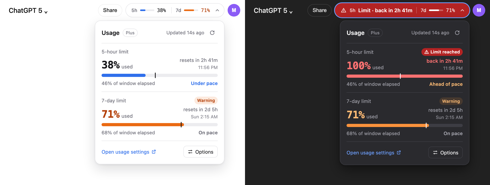
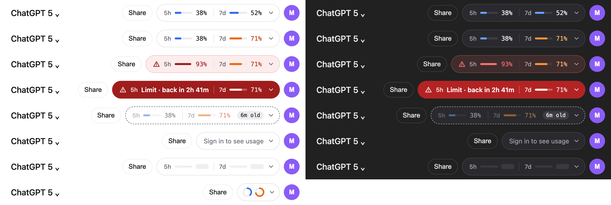
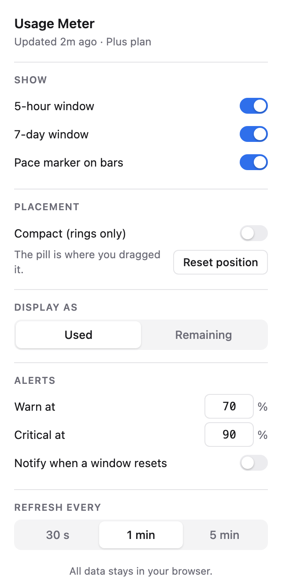

# Usage Meter for ChatGPT

A small Chrome extension that shows your ChatGPT **5-hour** and **7-day** usage limits right in the chat page, so you never have to dig through Settings to check how much you have left.



- **At a glance:** a pill in the top bar shows how much of each limit you've used.
- **Warnings:** turns orange at 70% and red at 90% (both adjustable), and shows a countdown when you hit a limit.
- **Pace:** tells you whether you're using your allowance faster or slower than time is passing.
- **Private:** everything stays in your browser. No servers, no tracking, no analytics.

> **Early version (v0.1).** The numbers come from an internal ChatGPT endpoint that OpenAI doesn't document. If it changes, or doesn't report limits for your plan, the pill shows **Couldn't refresh** instead of numbers. See [Troubleshooting](#troubleshooting).

---

## Install (about 2 minutes, no coding)

### 1. Download

**[⬇ Download usage-meter.zip](https://github.com/shimatt/GPT-Usage-Tracker/releases/latest/download/usage-meter.zip)** (always the latest version)

Unzip it. You'll get a folder called **`usage-meter`**. Move it somewhere permanent, like your Documents folder. Chrome loads the extension from this folder every time it starts, so **don't delete it**.

### 2. Load it into Chrome

1. Open a new tab and go to **`chrome://extensions`**
2. Turn on **Developer mode** (switch in the top-right corner)
3. Click **Load unpacked**
4. Select the **`usage-meter`** folder you unzipped (the folder itself, not a file inside it)

Usage Meter now appears in your extensions list. Click the 🧩 puzzle icon in the toolbar and pin it if you want quick access to its options.

### 3. Use it

Open **[chatgpt.com](https://chatgpt.com)** while signed in. The meter appears in the top bar within a few seconds.

> Works in Chrome 120 or newer. Other Chromium browsers such as Edge and Brave can also load unpacked extensions from their own extensions page (e.g. `edge://extensions`), though they haven't been tested.

---

## What you'll see



| Pill | Meaning |
| --- | --- |
| Blue bars | You're under your warning level |
| Orange | One limit is at or above **Warn at** (70% by default) |
| Red tint and ⚠ | One limit is at or above **Critical at** (90% by default) |
| Solid red, "Limit · back in 1h 12m" | You've hit a limit; the countdown shows when it resets |
| Dashed border, "6m old" | Couldn't refresh; showing the last numbers it got. Click to retry. |
| "Sign in to see usage" | You're signed out of ChatGPT |

**Click the pill** for details on each limit: exact percentage, when it resets, and a **pace marker**. The thin line on the bar shows how much of the time window has passed:

- **Under pace:** you're using less than the time elapsed, so you have room to spare.
- **On pace:** about even.
- **Ahead of pace:** at this rate you'll hit the limit before it resets.

**Drag the pill** anywhere if it's in the way. It stays where you put it on every ChatGPT tab.

## Options

Click the Usage Meter icon in Chrome's toolbar, or **Options** in the pill's popup.



- **Show:** choose which limits to display, and whether to show the pace marker.
- **Compact:** two small rings instead of bars; hover for the numbers.
- **Reset position:** puts a dragged pill back in the top bar.
- **Display as:** percent **used** or percent **remaining**.
- **Warn at / Critical at:** when the pill turns orange and red.
- **Notify when a window resets:** a desktop notification when your allowance is back. Chrome asks for permission the first time.
- **Refresh every:** 30 seconds, 1 minute (default) or 5 minutes.

Settings sync to any computer where you're signed into Chrome with the same account.

<br clear="right" />

---

## Updating

1. Download the latest **[usage-meter.zip](https://github.com/shimatt/GPT-Usage-Tracker/releases/latest/download/usage-meter.zip)**
2. Unzip it and **replace** your old `usage-meter` folder (same location, same name, so your settings are kept)
3. Go to `chrome://extensions` and click the **↻** reload icon on Usage Meter
4. Refresh any open ChatGPT tabs

To uninstall, click **Remove** on Usage Meter in `chrome://extensions`, then delete the folder.

## Troubleshooting

**The pill says "Couldn't refresh" or "Usage format changed."**
ChatGPT didn't return usage data in the format the extension expects. The endpoint may have changed, or it may not report these limits for your plan. Please [open an issue](https://github.com/shimatt/GPT-Usage-Tracker/issues) with your plan type (Free, Plus, Pro, Team…).

**The pill doesn't show up, or covers other buttons.**
ChatGPT redesigns its page often. If the extension can't find its spot in the top bar, it appears near the top-right corner instead. Just drag it wherever you like.

**"Sign in to see usage."**
Sign in at chatgpt.com, then switch back to the tab.

**Nothing happens after updating.**
Click ↻ on Usage Meter in `chrome://extensions` and refresh your ChatGPT tabs. Tabs that were already open keep running the old version.

## Privacy

- The extension only runs on `chatgpt.com`.
- It reads your usage with the login you already have in that tab, from the same internal endpoint ChatGPT uses for its usage page. Your login token is kept in memory only and never saved.
- Usage numbers are cached in your browser so open tabs can share them. Nothing is sent anywhere else.
- It's read-only: it never changes anything on your account.

This is an unofficial project and isn't affiliated with or endorsed by OpenAI.

---

## For developers

Requires Node.js 20+.

```sh
npm install
npm run build       # builds the extension into dist/ (load that folder unpacked)
npm run watch       # rebuilds on save; then click ↻ in chrome://extensions
npm test            # unit tests
npm run typecheck
npm run package     # builds release/usage-meter.zip
```

**Project layout**

```
src/lib/          data layer: session token + usage fetch, parsing, cache, pace, formatting, settings
src/content/      the pill and popover injected into chatgpt.com (Shadow DOM)
src/background/   service worker: reset notifications, opening options
src/popup/        options popup
tests/            node --test suites
fixtures/         sample API response used by the tests
build.mjs         esbuild bundling, icon generation, test runner, packaging
```

The top-bar position is set by `ANCHOR_SELECTORS` in `src/content/index.ts`. Update it there when ChatGPT changes its markup.

**Publishing a release**

1. Bump `"version"` in `package.json` (the build copies it into the manifest)
2. Commit, then tag and push:
   ```sh
   git tag v0.1.1
   git push origin main --tags
   ```
3. GitHub Actions runs the tests, builds `usage-meter.zip` and attaches it to a new release. The download link above always points to the newest release.
